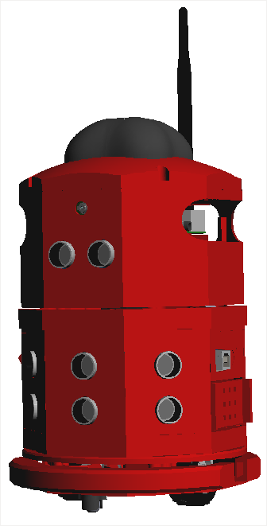
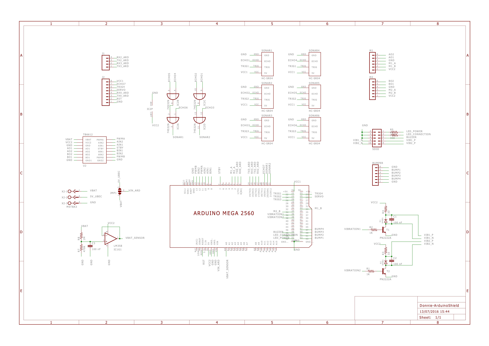
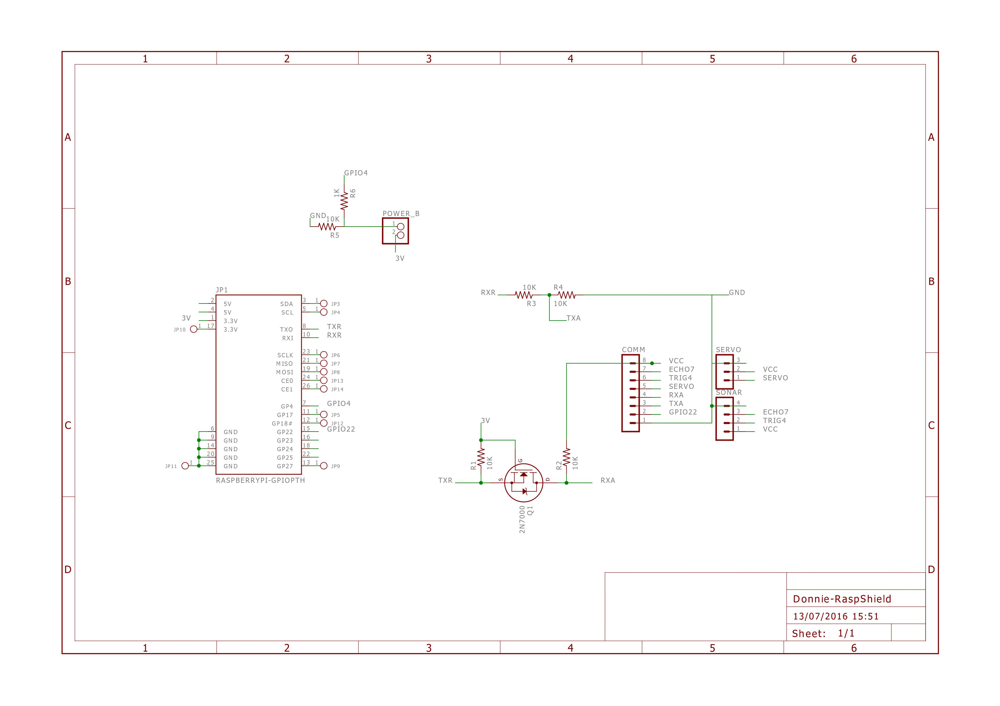
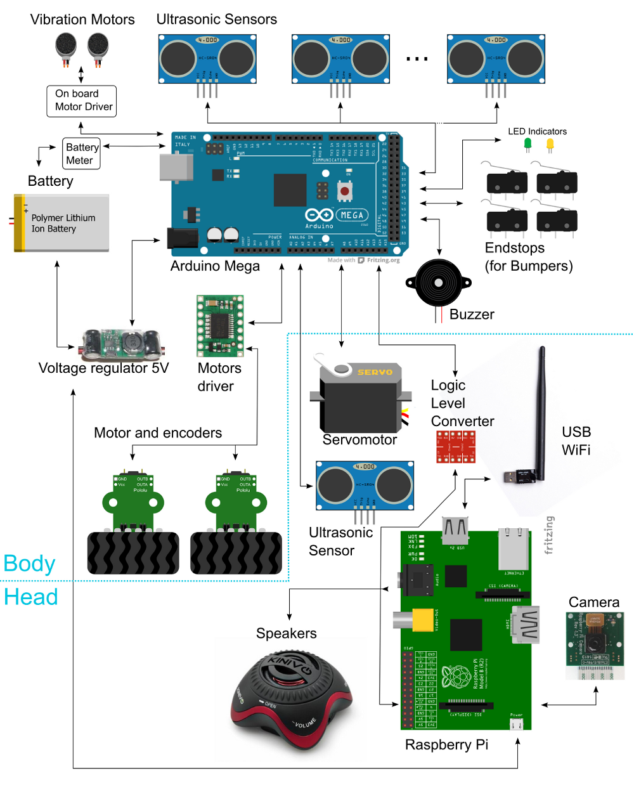

.. _arduino:

===============
Building Your Donnie Robot 
===============

Introduction
-------------

This manual has all files required to understand how to build the Donnie robot. 
It explains how to print the Donnie's body with a 3D printer and manufacture the 
necessary boards. It also tells you the operation of the firmware and teaches you 
how to assembly the parts.

Required Material
-----------------

Donnie requires about 500g of PLA. We use PLA because its low retraction
factor in large pieces.

Production Phase
----------------

1. The 3D printer requires the stl files, in the stl\_files folder.
2. We use `Slicer (1.2.9) <http://slic3r.org/>`__ to slice and 3d
   printing the robot. We use the following configs on slicer:

-  Infill: 20%;
-  Layer height: 0.3mm;
-  Without support (parts that need support have it in the model).

Modifying Donnie's Body
-----------------------

We used the Solidworks 2014 to model the robot. All the source files are
in the `solidworks directory <https://github.com/lsa-pucrs/donnie-assistive-robot-3d/tree/master/solidworks>`__.

Visualization
-------------

You can visualize the 3D PDF files with `Adobe Reader
9 <http://www.adobe.com/>`__ or above. You just need to click in "Enable
3D View" when open the 3D PDF.

   Meet Donnie !!!

Assembly the Arduino Part
-------------
Donnie's PCB
------------

The `repository <https://github.com/lsa-pucrs/donnie-assistive-robot-hw>`__ 
has all files related to Donnie's hardware (PCB design,
schematics, eletrical diagrams, gerber files, BOM files). Donnie has two
daugther boards (or 'shields'). One for the Arduino Mega and the other for 
the Raspberry Pi.

| The following image shows Donnie's brain and its electronics.
| |Meet Donnie Brain!!!|

Manufacturing the boards
------------------------

Send the Gerber for manufacturing
~~~~~~~~~~~~~~~~~~~~~~~~~~~~~~~~~

If you just want to manufacture these boards as they are, we recommend
the following steps:

1. Send the Gerber ZIP files
   (`ard-shield <https://github.com/lsa-pucrs/donnie-assistive-robot-hw/blob/master/ard-shield/gerbers/ard_shield-160322-gerbers.zip>`__
   and
   `rasp-shield <https://github.com/lsa-pucrs/donnie-assistive-robot-hw/blob/master/rasp-shield/gerber_files/rasp_shield-gerber_files-160118.zip>`__)
   to manufacture to Seeedstudio. You should use the following tutorial
   `Fusion PCB Order Submission
   Guidelines <http://support.seeedstudio.com/knowledgebase/articles/422482-fusion-pcb-order-submission-guidelines>`__

Arduino Shield
~~~~~~~~~~~~~

Rasp Shield
~~~~~~~~~~~

Assembly
~~~~~~~~

After you receive the PCBs, then follow these steps to assemble the
boards:

1. First of all, separe and buy the components indicated in BOM file
   (`ard-shield <https://github.com/lsa-pucrs/donnie-assistive-robot-hw/blob/master/ard-shield/BOM.txt>`__ and
   `rasp-shield <https://github.com/lsa-pucrs/donnie-assistive-robot-hw/blob/master/rasp-shield/BOM.txt>`__);
2. Print the PDF schemmatic and BOM file;
3. Place and weld the componnects in the PCB with the BOM's indicated
   PART.

Change the PCB Design
---------------------

If you want to change the PCB design, we recommend to use Eagle version
XYZ.

Arduino Firmware
-----------------

Before explaining how the arduino firmware arrangement works,
it’s important to learn a little about where the firmware takes 
place throughout the project.
There is the high level language called 
`GoDonnie <https://donnie-user-manual.readthedocs.io/en/stable/docs/godonnie/index.html>`__,
which connects with the Stage and the simulated robot or with the physical robot. 
When this connection is established with the physical robot the Raspberry Pi, 
that communicates with the language, translates the high level commands 
into lower level commands and then sends them to the arduino. The arduino, 
in turn, commands directly the sensors and the actuators of the physical robot.

.. image:: schematic.png

The firmware is the code that intermediate between the GoDonnie 
language and the hardware device, and it runs in the arduino.
The arduino firmware it’s directly connected with the Raspberry Pi, 
which sends commands to the arduino that causes the motors to move 
and the sensors to function. Shortly thereafter the arduino sends back 
to the Raspberry Pi the information obtained by the sensors. The 
`Player <https://playerstage-manual.readthedocs.io/en/latest/>`__
server runs in the Rasp, which is connected with the GoDonnie 
through the computer. The robot’s camera is also connected through 
the Rasp, that receives the image from the camera and sends to the 
Player, which processes the images.

