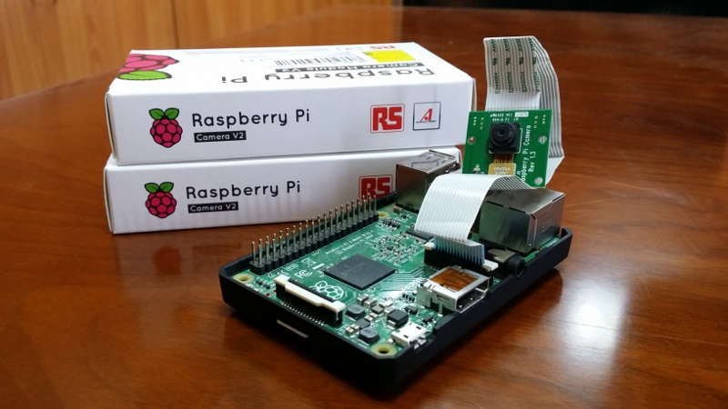
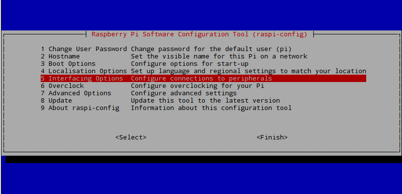
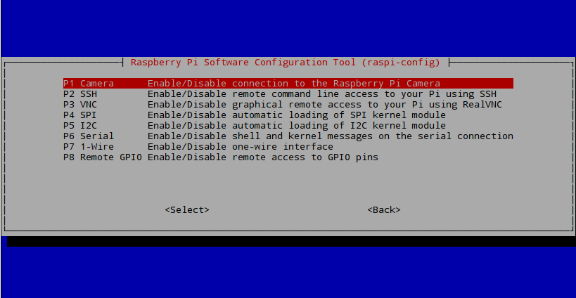

.. _video-streaming2:

====================================================
Video Streaming with RapsberryPI Using mjpgStreamer
====================================================

.. tip ::

   In this tutorial, you will:	
	* Learn how to configure your Raspberry Pi for video streaming through the mjpgStreamer Method
	* Know the commands needed for simple video streaming through mjpgStreamer
	* Acquire the dependencies needed for mjpgStreamer

.. tip ::
	
	 This demonstration was tested on:
		* Google Chrome Version 56.0.2924.87 on a Windows 8.1 64-bit Computer
		* 2017/1/11 Raspbian Jessi on a RBpi 2 Model B V1.1 using Pi Camera rev 1.3
		* Note: Pi Camera V2.1 was also tested successfully
	

This tutorial will introduce to you to your Raspberry Pi Camera Module to view a video stream from your Pi setup, the server using Raspbian, to a different computer, a client using Windows, in your home network

Configuring your RaspberryPi
=============================

Firstly, on your Pi's terminal, Update and Upgrade the environment so it can be up to date. This helps in reducing future problems. Don't forget to ENABLE your Raspberry Pi Camera using 'raspi-config'.

.. code-block:: bash

    $ sudo apt-get update    
    $ sudo apt-get upgrade

.. code-block:: bash

    $ sudo raspi-config

A blue BIOS-like screen will appear, go into the Enable Camera Options and enable the camera.

.. NOTE::
	Depending on your version of Raspbian, the Enable setting may not first appear on the main list. You will have to go under the settings in the blue screen to locate the enable option.

It is also advised now to see what is the IP Address of your Pi.
Type in the following to locate the IP as you will need it in the Browser for your Windows machine.

.. code-block:: bash

    $ ifconfig

| If you are using a wireless connection,
| the IP you want is located in the ``lo`` section under ``inet addr:x.x.x.x``
| If you are using ethernet, 
| it will be under ``eth0`` in ``inet addr:x.x.x.x``
|

Getting mjpgStreamer
====================

We will now install mjpgStreamer on our Pi, the main focus of this method
To do this, we will go to the `mjpgStreamer website <https://lilnetwork.com/download/raspberrypi/mjpg-streamer.tar.gz>`_
which will automatically start the download.

We will need to decompress the file, this process will also install it at the same time.

.. code-block:: bash

	$ tar -zxvf mjpg-streamer.tar.gz

Press Enter, and you should see a new directory called ``mjpg-streamer``

.. NOTE::

	You can check for directories in the terminal by typing in ``ls``

Getting mjpgStreamer's Dependencies
===================================

Now we need mjpgStreamer's dependancies to make it fully functional. 

.. code-block:: bash

	$ sudo apt-get install libjpeg8-dev
	$ sudo apt-get install imagemagick

After this is done, go into the mjpg-streamer directory inside the already existing mjpg-streamer.
**Yes, type it twice**.
And then type ``make`` which will build the system and compile it

.. code-block:: bash

	$ cd mjpg-streamer
	$ cd mjpg-streamer
	$ make

In order to start the capture, we must make a temporary file that will save the image taken by raspistill, and then it will get updated many times every second. 
So in ``~/mjpg-streamer/mjpg-streamer $`` type in:

.. code-block:: bash

	$ mkdir /tmp/stream

We can now initiate the stream by typing in

.. code-block:: bash

	$ LD_LIBRARY_PATH=./ ./mjpg_streamer -i "input_file.so -f /tmp/stream -n pic.jpg" -o "output_http.so -w ./www"

Open a new terminal window and type

.. code-block:: bash

	$ raspistill -w 640 -h 480 -q 5 -o /tmp/stream/pic.jpg -tl 1 -t 9999999 -th 0:0:0
	

*	``-w`` and -h is resolution
*	``-q`` is quality
*	``-o`` is the Specified output filename
*	``-tl`` is the time interval between each snap shot (here is 1 millisecond)
*	``-t`` is the camera's ON time in seconds, 9999999 is 115 Days
*	``-th`` Set thumbnail parameters (x:y:quality)

Now, on your client computer, open your preferred browser and type in your ``IP`` and ``port#`` which will be 8080 by default.

.. code-block:: bash
	
	x.x.x.x:8080

A website will display showing you the mjpgStreamer Demo Page and a congratulation message.
Go to the stream section in the menu to see the live footage from your Pi.

.. raw:: html 

  	 

.. NOTE::
	As you can see from the stream that the video quality is not that ground breaking but is acceptable, although a little worse than the VLC method, however the latency is a so much better than in the VLC method.

Video Demonstration
===================

.. youtube:: qyzUSeduGew

.. NOTE::
	The Monitor on the left displays real time from the Raspberry directly, whereas the Laptop is displaying the mjpgSteamer stream.

Raspberry Pi Camera Stream Web Video.
This video tutorial shows the overview of this written tutorial.

.. youtube:: TgUQCSk3nUE

END 2
=====

