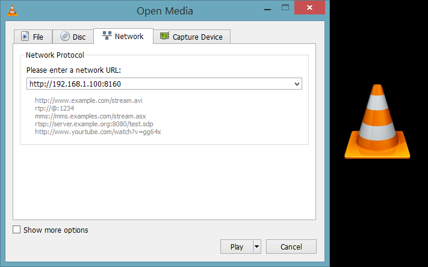

.. _video-streaming:

==========================================
Video Streaming with RaspberryPi Using VLC
==========================================

.. tip ::

   In this tutorial, you will:	
	* Learn how to configure your Raspberry Pi for video streaming
	* Know the commands needed for simple video streaming through the VLC media tool

.. tip ::
	
	 This demonstration was tested on:
		* VLC 2.2.4 on a Windows 8.1 64-bit Computer
		* 2017/1/11 Raspbian Jessi on a RBpi 2 Model B V1.1 using Pi Camera rev 1.3
		* Note: Pi Camera V2.1 was also tested successfully
	

This tutorial will introduce to you to your Raspberry Pi Camera Module to view a video stream from your Pi setup, the server using Raspbian, to a different computer, a client using Windows, in your home network

.. image:: images/raspberrypi2.jpg
    :align: center

Configuring your RaspberryPi
=============================

Firstly, on your Pi's terminal, Update and Upgrade the environment so it can be up to date. This helps in reducing future problems. Don't forget to ENABLE your Raspberry Pi Camera using 'raspi-config'.

.. code-block:: bash

    $ sudo apt-get update    
    $ sudo apt-get upgrade

.. code-block:: bash

    $ sudo raspi-config

A blue BIOS-like screen will appear, go into the Enable Camera Options and enable the camera.

.. image:: images/Blue1.png
    :align: center

.. image:: images/Blue2.png
    :align: center

.. NOTE::
	Depending on your version of Raspbian, the Enable setting may not first appear on the main list. You will have to go under the settings in the blue screen to locate the enable option.

It is also advised now to see what is the IP Address of your Pi.
Type in the following to locate the IP as you will need it in the VLC program for your Windows machine.

.. code-block:: bash

    $ ifconfig

| If you are using a wireless connection,
| the IP you want is located in the ``lo`` section under ``inet addr:x.x.x.x``
| If you are using ethernet, 
| it will be under ``eth0`` in ``inet addr:x.x.x.x``
|

Getting VLC
=========== 

On your Client PC that is running Windows, download the VLC software media tool on here through the `VLC's Website <http://www.videolan.org/vlc/index.html>`_

Now on your Pi's terminal, download and install the VLC for Raspbian.

.. code-block:: bash

	$ sudo apt-get install vlc
.. NOTE::
	Make sure that your Pi is up-to-date and also now has VLC
	and that your PC has VLC installed, before going to the next step

Initiating the Stream
=====================

Once installed, you may now start the video streaming by typing the folloing in your Pi's Terminal.

.. code-block:: bash

	$ raspivid -o - -t 0 -hf -w 800 -h 400 -fps 24 |cvlc -vvv stream:///dev/stdin --sout '#standard{access=http,mux=ts,dst=:8160}' :demux=h264

*	``-o`` Specifies the output filename. the '-' beside denotes no filename
*	``-t`` is the duration of the recoding, 0 being infinity
*	``-hf`` is Horizontal Flip
*	``-w`` and -h is the resolution for Width and Height
*	``-fps`` is Frames per Second
*	The rest means that on ``port 8160``, data will be sent through http using h264 as stdout using VLC

Once entered, the Pi Camera will turn on and start recording and simultaneously send it over http. 
This is now the time to go to your Windows machine and watch your streaming footage.

.. NOTE::
	You may want to experiment and change settings like ``-w``, ``-h``, and ``-fps``.

Open the VLC program on your Windows Machine.

And under ``Media`` > ``Open Network Stream`` > ``Network`` > ``Please enter a network URL:``

Type in the IP address that you got from ``ifconfig`` like so;

.. code-block:: bash

	http://x.x.x.x:8160

As we have specified the port to be 8160 in our terminal on the Pi

Once entered, VLC will automatically start playing the stream from the Pi over your network.

Conclusion
==========

.. NOTE::
	As you can see from the stream that the video quality is not that ground breaking but is acceptable, and the latency is the biggest issue of this streaming method.

Video Demonstration
===================

.. youtube:: qyzUSeduGew

.. NOTE::
	The Monitor on the left displays real time from the Raspberry directly, whereas the Laptop is displaying the VLC stream.

Raspberry Pi camera module streaming video to another computer.
This video tutorial shows the overview of this written tutorial.

.. youtube:: JjPsW-7FUng
|

END
===

