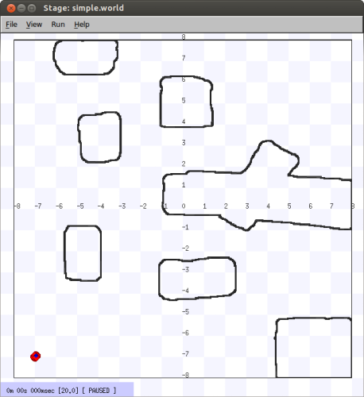

.. _stage:

===============
Stage Multi Robot Simulator 
===============

Introduction
-------------

.. image:: ./images/stage.png
    :align: center
    :alt: sempre use alt para descreve a imagem p um deficiente visual

explica brevemente, cita o artigo, mostra algum exemplo pronto.

How to Create a New Environment
-------------

The Basic
~~~~~~~~~

Player/Stage is a robot simulating tool, it comprises of one program, Player, 
which is a Hardware Abstraction Layer. That means that it talks to the bits of 
hardware on the robot (like a claw or a camera) and lets you control them with 
your code, meaning you don't need to worry about how the various parts of the 
robot work. Stage is a plugin to Player which listens to what Player is telling 
it to do and turns these instructions into a simulation of your robot. It also 
simulates sensor data and sends this to Player which in turn makes the sensor 
data available to your code.

A simulation then, is composed of three parts:

- Your code. This talks to Player.
- Player. This takes your code and sends instructions to a robot. From the 
    robot it gets sensor data and sends it to your code.
- Stage. Stage interfaces with Player in the same way as a robot's hardware 
    would. It receives instructions from Player and moves a simulated robot in a 
    simulated world, it gets sensor data from the robot in the simulation and 
    sends this to Player.

In Player/Stage there are 3 kinds of file that you need to understand to get 
going with Player/Stage:

- a .world file
- a .cfg (configuration) file
- a .inc (include) file

The .world file tells Player/Stage what things are available to put in the world. 
In this file you describe your robot, any items which populate the world and the 
layout of the world. The .inc file follows the same syntax and format of a .world 
file but it can be included. So if there is an object in your world that you might 
want to use in other worlds, such as a model of a robot, putting the robot description 
in a .inc file just makes it easier to copy over, it also means that if you ever want 
to change your robot description then you only need to do it in one place and your 
multiple simulations are changed too.

The .cfg file is what Player reads to get all the information about the robot that 
you are going to use.This file tells Player which drivers it needs to use in order 
to interact with the robot, if you're using a real robot these drivers are built in 
to Player (or you can download or write your own drivers, but I'm not going to talk 
about how to do this here.) Alternatively, if you want to make a simulation, the driver 
is always Stage (this is how Player uses Stage in the same way it uses a robot: it thinks 
that it is a hardware driver and communicates with it as such). The .cfg file tells 
Player how to talk to the driver, and how to interpret any data from the driver so that 
it can be presented to your code. Items described in the .world file should be described 
in the .cfg file if you want your code to be able to interact with that item (such as a robot), 
if you don't need your code to interact with the item then this isn't necessary. The .cfg 
file does all this specification using interfaces and drivers.

Building an Empty World
~~~~~~~~~~~~~~~~~~

To start building an empty world we need a .cfg file. First create a document called empty.cfg 
(i.e. open in your favorite text editor) and copy the following code into it:

::

    driver
    (       
       name "stage"
       plugin "stageplugin"

       provides ["simulation:0" ]

       # load the named file into the simulator
       worldfile "empty.world"  
    )

Basically what is happening here is that your configuration file is telling Player 
that there is a driver called stage in the stageplugin library, and this will give 
Player data which conforms to the simulation interface. To build the simulation 
Player needs to look in the worldfile called empty.world which is stored in the 
same folder as this .cfg. If it was stored elsewhere you would have to include a 
filepath, for example ./worlds/empty.world. Lines that begin with the hash symbol 
(#) are comments. When you build a simulation, any simulation, in Stage the above 
chunk of code should always be the first thing the configuration file says. 
Obviously the name of the worldfile should be changed depending on what you called it though.

Now a basic configuration file has been written, it is time to tell Player/Stage what 
to put into this simulation. This is done in the .world file.

Models
~~~~~~

A worldfile is basically just a list of models that describes all the stuff in the simulation. 
This includes the basic environment, robots and other objects. The basic type of model is 
called "model", and you define a model using the following syntax:

::

    define model_name model
    (
         # parameters
    )

This tells Player/Stage that you are ``defining`` a ``model`` which you have called ``model_name``, 
and all the stuff in the round brackets are parameters of the model. To begin to understand 
Player/Stage model parameters, let's look at the ``map.inc`` file that comes with Stage, this 
contains the ``floorplan`` model, which is used to describe the basic environment of the simulation 
(i.e. walls the robots can bump into):

::

    define floorplan model
    (
    # sombre, sensible, artistic
    color "gray30"

    # most maps will need a bounding box
    boundary 1

    gui_nose 0
    gui_grid 0
    gui_move 0
    gui_outline 0
    gripper_return 0
    fiducial_return 0
    ranger_return 1
    )

We can see from the first line that they are defining a ``model`` called ``floorplan``.

- ``color``: Tells Player/Stage what colour to render this model, 
    in this case it is going to be a shade of grey.
-  ``boundary``: Whether or not there is a bounding box around the
   model. This is an example of a binary parameter, which means the if
   the number next to it is 0 then it is false, if it is 1 or over then
   it's true. So here we DO have a bounding box around our "map" model
   so the robot can't wander out of our map.
-  ``gui_nose``: this tells Player/Stage that it should indicate which
   way the model is facing.
-  ``gui_grid``: this will superimpose a grid over the model.
-  ``gui_move``: this indicates whether it should be possible to drag
   and drop the model. Here it is 0, so you cannot move the map model
   once Player/Stage has been run.
-  ``gui_outline``: indicates whether or not the model should be
   outlined. This makes no difference to a map, but it can be useful
   when making models of items within the world.
-  ``fiducial_return``: any parameter of the form some\_sensor\_return
   describes how that kind of sensor should react to the model.
-  ``ranger_return``: Setting ``ranger_return`` to a negative number
   indicates that a model cannot be seen by ranger sensors. Setting
   ``ranger_return`` to a number between 0 and 1 (inclusive) (Note: this
   means that ``ranger_return 0`` **will allow** a ranger sensor to see
   the object --- the *range* will get set, it'll just set the
   *intensity* of that return to zero.)
-  ``gripper_return``: Like ``fiducial_return``, ``gripper_return``
   tells Player/Stage that your model can be detected by the relevant
   sensor, i.e. it can be gripped by a gripper. Here ``gripper_return``
   is set to 0 so the map cannot be gripped by a gripper.

To make use of the ``map.inc`` file we put the following code into our
world file:

::

    include "map.inc"

This inserts the ``map.inc`` file into our world file where the include
line is. This assumes that your worldfile and ``map.inc`` file are in
the same folder, if they are not then you'll need to include the
filepath in the quotes. Once this is done we can modify our definition
of the map model to be used in the simulation. For example:

::

    floorplan
    (
       bitmap "bitmaps/helloworld.png"
       size [12 5 1]    
    )

What this means is that we are using the model "floorplan", and making
some extra definitions; both "bitmap" and "size" are parameters of a
Player/Stage model. Here we are telling Player/Stage that we defined a
bunch of parameters for a type of model called "floorplan" (contained in
map.inc) and now we're using this "floorplan" model definition and
adding a few extra parameters.

-  ``bitmap``: this is the filepath to a bitmap, which can be type bmp,
   jpeg, gif or png. Black areas in the bitmap tell the model what shape
   to be, non-black areas are not rendered, this is illustrated in
   Figure 3.4. In the map.inc file we told the map that its "color"
   would be grey. This parameter does not affect how the bitmaps are
   read, Player/Stage will always look for black in the bitmap, the
   ``color`` parameter just alters what colour the map is rendered in
   the simulation.
-  ``size``: This is the size *in metres* of the simulation. All sizes
   you give in the world file are in metres, and they represent the
   actual size of things. If you have 3m x 4m robot testing arena that
   is 2m high and you want to simulate it then the ``size`` is [3 4 2].
   The first number is the size in the *x* dimension, the second is the
   *y* dimension and the third is the *z* dimension.

Describing the Player/Stage Window
~~~~~~~~~~~~~~~~~~~

The worldfile also can be used to describe the simulation window that
Player/Stage creates. Player/Stage will automatically make a window for
the simulation if you don't put any window details in the worldfile,
however, it is often useful to put this information in anyway. This
prevents a large simulation from being too big for the window, or to
increase or decrease the size of the simulation.

Like a model, a window is an inbuilt, high-level entity with lots of
parameters. Unlike models though, there can be only one window in a
simulation and only a few of its parameters are really needed. The
simulation window is described with the following syntax:

::

    window
    (
       # parameters...
    )

The two most important parameters for the window are ``size`` and
``scale``.

-  ``size``: This is the size the simulation window will be *in pixels*.
   You need to define both the width and height of the window using the
   following syntax: ``size [width height]``.
-  ``scale``: This is how many metres of the simulated environment each
   pixel shows. The bigger this number is, the smaller the simulation
   becomes. The optimum value for the scale is
   window\_size/floorplan\_size and it should be rounded downwards so
   the simulation is a little smaller than the window it's in, some
   degree of trial and error is needed to get this right.

We have already discussed the basics of worldfile building: models and
the window. Finally, we are able to write a worldfile!

::

    include "map.inc"

    # configure the GUI window
    window
    ( 
       size [700.000 700.000] 
       scale 41
    )

    # load an environment bitmap
    floorplan
    (
       bitmap "bitmaps/cave.png" 
       size [15 15 0.5]
    )

If we save the above code as empty.world (correcting any filepaths if
necessary) we can run its corresponding empty.cfg file.

::
    > cd <source_code>/worlds
    > player empty.cfg &

Running the ``empty.cfg`` file you should see the following simulation:

To modify your simulation's scenario just create a drawing in black in an 
image editor of your preference and save the file in one of the specified 
formats. After that, just put the name of the file in the ``bitmap`` 
parameter inside your .world file. Save the image in the bitmaps folder. 
In case you prefer to save the image in another folder you'll have to especify 
the path to the image in the .world file.

How to Create an Environment with Multiple Robots
-------------

fazer tipo um tutorial bem passo a passo
